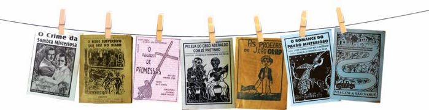

# Projeto Cordel Moderno. 

Projeto proposto e criado no curso de HTML5 e CSS3 do Professor Gustavo Guanabara.

Este foi o meu segundo projeto criado somente com HTML5 e CSS3, este desafio explorou novas configurações em CSS3 tais como, imagens de fundo, efeito parallax, adaptação de fontes de acordo com o tamanho da tela.
Este projeto pude colocar em prática todo conteudo apresentado no curso até este momento, deixando o site responsivo conforme a proposta.

<a href="#" target="_blank" >Clique aqui para ter acesso ao site!</a>

Deixo meus créditos ao cirador deste belo cordel<a href="https://www.recantodasletras.com.br/poesias/3186743" target="_blank" >Milton Duarte.</a>

# A cultura da Literatura de Cordel.

O Brasil é realmente um país múltiplo quando se fala em cultura, principalmente quando falamos de cultura popular. 
Uma dessas manifestações populares é a literatura de cordel. Ela tem esse nome pois os pequenos folhetos com os poemas são impressos e ficam presos em cordas para a exposição. 

“O espaço entre a teoria e a prática não é tão grande como é, a teoria na prática.”
Autor desconhecido.
